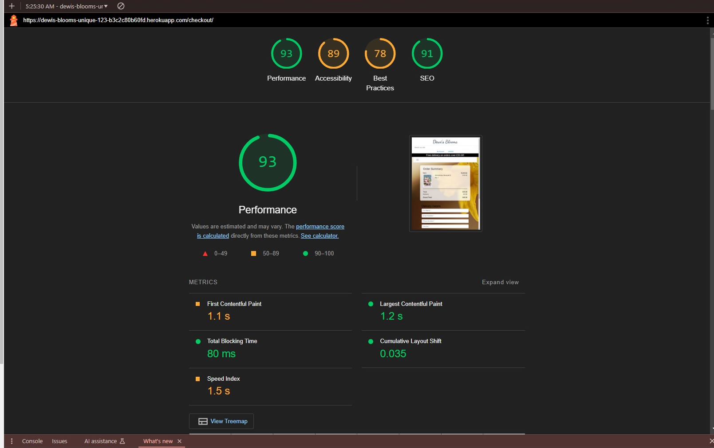

### Dewi's Blooms - Florist E-commerce Project
###### Code Institute / Full-Stack Development / Milestone Project
------------

[View Live Project Here](https://dewis-blooms-unique-123-b3c2c80b60fd.herokuapp.com/)

### Introduction

Dewi's Blooms is a fictional Welsh florist e-commerce site created to provide users with an effortless and delightful shopping experience for floral arrangements and gifts. The site showcases a range of flower categories, allowing customers to browse, purchase, and schedule deliveries for special occasions. Users can make secure payments via Stripe and receive confirmation emails after completing their orders.

Visitors can create an account to save personal details, manage order histories, and even set reminders for special dates, making the gifting process smoother and more personalized. Accounts also enable users to save time on future purchases by storing their shipping and billing information.

The site features products in multiple categories, such as bouquets, floral arrangements, and seasonal flowers, managed entirely by the admin. Administrators have full CRUD (Create, Read, Update, Delete) capabilities for managing products, categories, and other backend functions.

Stripe is used for secure payments, ensuring a safe and reliable checkout experience. The platform is currently in 'test' mode, meaning no real payments will be taken. To test the checkout process, you can use Stripe's test card numbers. For valid test payments, use:

- **Card Number:** 4242 4242 4242 4242  
- **CVC:** Any 3 digits  
- **Expiration Date:** Any future date  

To access admin functionality and explore the backend features of the site, use the following superuser credentials:

- **Username:** ashwinsel
- **Email:**ashwinsel@someemail.com  
- **Password:** Anusha1990  

Dewi's Blooms not only highlights the beauty of flowers with high-quality imagery but also provides a seamless e-commerce experience that ensures users feel confident and satisfied with their purchase journey.

.png)

---

## **Index - Table of Contents**
------------

1. [Introduction](#introduction)
2. [User Experience (UX)](#user-experience-ux)
    - [User Stories](#user-stories)
3. [UX Planes](#ux-planes)
    - [Strategy](#strategy)
    - [Scope](#scope)
    - [Structure](#structure)
    - [Surface](#surface)
4. [Wireframes](#wireframes)
5. [Features](#features)
    - [Homepage](#1-homepage)
    - [Shop Page](#2-shop-page)
    - [Product Detail Page](#3-product-detail-page)
    - [Shopping Cart](#4-shopping-cart)
    - [Checkout Page](#5-checkout-page)
    - [User Accounts](#6-user-accounts)
    - [Admin Features](#7-admin-features)
    - [Responsive Design](#8-responsive-design)
6. [Future Development and Implementation Options](#future-development-and-implementation-options)
7. [Technologies Used](#technologies-used)
8. [Custom Models and Database Schema](#custom-models-and-database-schema)
    - [Entity Relationship Diagram (ERD)](#entity-relationship-diagram-erd)
9. [List of Bugs and Fixes](#list-of-bugs-and-fixes)
10. [Testing](#testing)
    - [Validator Testing Results](#validator-testing-results)
    - [Manual Testing (Feature Testing)](#manual-testing-feature-testing)
11. [Lighthouse Audit](#lighthouse-audit)
12. [Deployment](#deployment)
    - [Heroku Deployment](#heroku-deployment)
    - [Email Configuration](#email-configuration)
    - [Stripe Setup](#stripe-setup)
    - [Clone the Project](#clone-the-project)
13. [Project Summary](#project-summary)
14. [Credits](#credits)
15. [Acknowledgements](#acknowledgements)
16. [Gratitude](#gratitude)

---

## **User Experience (UX)**
------------

### **User Stories**

| **App Function**                   | **As a/an user/shopper**       | **I want to be able to...**                                 | **So that I can...**                                        |
|-------------------------------------|--------------------------------|--------------------------------------------------------------|-------------------------------------------------------------|
| **1. Viewing and Navigation**       | Shopper                        | Browse flowers and floral arrangements                       | See the available products for purchase                     |
|                                     | Shopper                        | View detailed product pages                                  | Learn more about each product, including price and details  |
|                                     | Shopper                        | Navigate between categories (e.g., bouquets, single flowers) | Easily find the type of flowers I’m looking for             |
|                                     | Shopper                        | Search for products using keywords                           | Locate a specific flower or arrangement                     |
|                                     | Shopper                        | View a responsive layout on mobile and desktop               | Have a seamless experience no matter which device I use     |
| **2. Registration and User Accounts** | Shopper                        | Register for an account                                      | Save my information for faster future purchases             |
|                                     | Shopper                        | Log in to my account                                         | Access my saved preferences and order history               |
|                                     | Shopper                        | Update my personal information (e.g., address, email)        | Keep my profile information up to date                      |
|                                     | Shopper                        | View my order history                                        | Check past orders for reordering or reference               |
| **3. Sorting and Searching**        | Shopper                        | Filter products by category (e.g., bouquets, arrangements)   | Quickly find products that match my preferences             |
|                                     | Shopper                        | Search for specific products                                 | Locate items that meet my exact needs                       |
| **4. Purchasing and Checkout**      | Shopper                        | Add products to a shopping cart                              | Save items I’m interested in purchasing                     |
|                                     | Shopper                        | View my shopping cart                                        | Review my selected items before checkout                    |
|                                     | Shopper                        | Pay for my order securely using Stripe                       | Complete my purchase with confidence that my payment is safe|
|                                     | Shopper                        | Enter shipping and billing information during checkout       | Ensure my order is delivered to the correct address         |
|                                     | Shopper                        | Receive an order confirmation email                          | Know my order was placed successfully                       |
| **5. Notifications and Reminders**  | Admin                         | View customer orders                                         | Fulfill orders and manage stock effectively                 |
| **6. Admin Features**               | Admin                         | Add, edit, or remove products                                | Keep the product catalog up to date                         |
|                                     | Admin                         | Manage customer orders                                       | Ensure efficient order processing and delivery              |

[Back to Index - Table of Contents](#index---table-of-contents)

---

## **UX Planes**
------------

- ### **Strategy**
    + The primary goal of **Dewi's Blooms** is to provide a user-friendly platform for browsing, purchasing, and sending flowers for various occasions.

- ### **Scope**
    - The website will provide the following functionalities:
        * User-friendly product browsing with filter and search options.
        * Secure payment system using **Stripe**.

- ### **Structure**
    ### Structure Plane: Organizing Information and Functionality

    The structure of Dewi's Blooms was planned with the user journey in mind, ensuring the site is intuitive and efficient for both shoppers and administrators. The app is split into four main categories, each serving a specific purpose and contributing to a seamless user experience. Below is an outline of these categories and the design considerations that influenced their implementation.

    ---

    #### **1. Browsing and Finding Products**
    Finding products is a fundamental aspect of the Dewi's Blooms app. Since the primary goal is to provide an enjoyable and easy shopping experience, the following structural features were implemented to facilitate browsing:

    - **Clear Navigation**: The navigation bar allows users to easily browse by product categories, such as bouquets, arrangements, and seasonal flowers.
    - **Search Functionality**: A search bar in the header enables users to find products directly by entering keywords.
    - **Product Details**: Each product page provides high-quality imagery, a detailed description, and pricing, allowing users to make informed decisions.
    - **Responsiveness**: The app has been designed to ensure users can browse products effortlessly across devices, whether on desktop or mobile.

    The structure mirrors conventional e-commerce sites to provide familiarity, but extra care was taken to include florist-specific features, such as showcasing seasonal arrangements and promoting featured bouquets prominently on the homepage.

    ---

    #### **2. The Checkout Process**
    The checkout process is designed for clarity and efficiency, ensuring users can complete purchases with minimal friction. Here’s how the structure supports a smooth checkout experience:

    - **Shopping Cart**: A cart icon in the navigation bar provides users with quick access to their selected items. The cart page displays item quantities, pricing, and a total cost summary.
    - **Delivery Details**: Users can input their shipping address and select a delivery date to suit their gifting needs.
    - **Secure Payments**: Stripe integration provides secure payment options. Users are reassured by the familiar interface of Stripe's payment form, while administrators benefit from its reliability.
    - **Confirmation Emails**: Users receive email confirmations with order details, reinforcing trust in the service and providing a reference for their purchase.

    The entire process was modeled on industry-standard UX practices, minimizing unnecessary steps while ensuring users feel secure and confident during the transaction.

    ---

    #### **3. User's Account**
    The user account functionality was designed to empower users to manage their details and view past transactions easily. The structure of the account page includes:

    - **Order History**: Users can view their past purchases and access detailed receipts, ensuring they can reorder products or track delivery.
    - **Profile Management**: Users can update personal information, such as their email address, shipping details, or password, directly from their profile.
    - **Saved Special Dates**: A unique feature allows users to store important dates (e.g., birthdays, anniversaries) and receive reminders, creating a personalized shopping experience.
    - **User-Friendly Navigation**: The account page uses a clean, list-style menu that directs users to relevant features, ensuring functionality is easy to find.

    This structure prioritizes simplicity and usability, enabling users to perform essential tasks without confusion.

    ---

    #### **4. Admin Features**
    The admin panel plays a critical role in maintaining the site’s functionality and product offerings. While Django’s built-in admin interface provides robust management capabilities, the following admin-specific features were added for convenience:

    - **Product Management**: Administrators can create, edit, and delete products directly from the backend, ensuring the product catalog remains up to date.
    - **Category Management**: Admins can manage product categories, allowing for seasonal updates or the addition of new product lines.
    - **Order Overview**: The admin dashboard includes an order management system where administrators can track and process customer orders.

    These features allow the admin to perform essential tasks efficiently while leveraging Django’s default tools for more advanced management tasks.

    ---

    #### **Flow of Information**
    The structure of Dewi's Blooms ensures that information flows logically throughout the site. Users begin by browsing the homepage or categories, navigating seamlessly to product pages. From there, they can add items to their cart and proceed to the checkout. Registered users can log in to save time and view their account details, while administrators manage content behind the scenes.

    All major sections—products, checkout, user accounts, and admin tools—are accessible from the navigation bar or through intuitive call-to-action buttons, ensuring users can achieve their goals quickly and easily.

    ---

    By organizing Dewi's Blooms into these key structural components, the app delivers a cohesive experience for users, providing the functionality they expect while maintaining a professional and visually appealing design. This thoughtful structure ensures that both customers and administrators can interact with the site effectively and efficiently.

    [Back to Index - Table of Contents](#index---table-of-contents)

---
### Wireframes

Below are the wireframes created to illustrate the intended layout and functionality of the Dewi's Blooms website. These wireframes were designed to ensure a user-friendly interface across different devices.

1. **Homepage**
   - 

2. **Login Page**
   - 

3. **Shopping Window**
   - 

4. **Checkout Page**
   - 

[Back to Index - Table of Contents](#index---table-of-contents)

---

- ### **Surface**
    + #### Colour Scheme
        ### Color Scheme for Dewi's Blooms

The **Dewi's Blooms** website has been designed with a clean and elegant **color palette** to evoke freshness and tranquility, aligning perfectly with the essence of a florist business. Here's a breakdown of the color choices:

1. **Primary Colors**:
   - **Soft Pastel Yellow**: Used in the hero section and banners, this color represents joy and freshness, echoing the natural beauty of flowers.
   - **White and Light Beige**: These neutral tones create a sense of simplicity and sophistication, ensuring that the focus remains on the vibrant floral arrangements.

2. **Accent Colors**:
   - **Green (Toast Messages)**: The green toasts grab attention without overwhelming the user, making them an effective tool for providing instant feedback, such as "Item added to cart" or "Action completed successfully."

3. **Typography Colors**:
   - **Dark Blue**: Used for the text, this color contrasts well against the lighter backgrounds, ensuring readability and professionalism.

### Why the Green Toast Messages Work
While green may initially seem unrelated to the pastel tones of the site, it serves an important purpose in the **UX design**:
- **Functionality**: The green color is vibrant and draws immediate attention, ensuring users notice important notifications like confirmation messages or errors.
+ #### Typography
        - ### Typography in Dewi's Blooms Application

The typography in **Dewi's Blooms** combines elegance with practicality:

- **Primary Font:** `Arial, Helvetica, sans-serif` ensures readability and accessibility across devices.
- **Accent Font:** `Dancing Script`, used in the logo and key headings, adds a floral, elegant touch that reflects the brand’s charm.
- **Colors:** Neutral shades (`#555`, `#333`) for readability, with vibrant accents like `#ff5733` (orange) and `#5a8c5a` (green) to align with the floral theme.
- **Responsive Design:** Font sizes adapt seamlessly for mobile and desktop, maintaining a user-friendly experience.

This typography balances sophistication and usability, reinforcing the boutique florist aesthetic.
+ #### Imagery

- **Imagery** plays a pivotal role in the **Dewi's Blooms** experience, creating a visual connection with our users:

- **Daffodil Background:** As the national flower of Wales, the daffodil symbolizes our roots and heritage. It serves as a key background element, reflecting Dewi's Blooms' identity as a Welsh florist.
- **High-Quality Product Images:** To showcase our floral arrangements in their best light, we use crisp, high-resolution images. These visually appealing photos allow customers to confidently assess the quality of our products.
- **User Experience Impact:** While the use of high-quality images slightly affects website load times, their inclusion is crucial. They provide a pleasing and detailed visual experience that builds trust and encourages customers to feel confident in spending their money.

Our imagery not only enhances the site’s aesthetic but also underscores our commitment to quality and authenticity, making the shopping experience delightful and trustworthy.

[Back to Index - Table of Contents](#index---table-of-contents)

---
## **Features**
------------
#### **1. Homepage**
- **Featured Products**:
  - Display a selection of highlighted flowers or arrangements.
- **Navigation Bar**:
  - Links to key sections: Shop, Cart, Login, and Account.
- **Search Bar**:
  - Allows users to search for products by name or keyword.
- **Responsive Design**:
  - Layout adjusts for both desktop and mobile users.

---

#### **2. Shop Page**
- **Product Listings**:
  - All available products are displayed in a grid format with:
    - Product image
    - Name
    - Price
    - "Add to Cart" button.
- **Category Filters**:
  - Users can filter products by categories like "Roses," "Bouquets," etc.

---

#### **3. Product Detail Page**
- **Detailed View**:
  - Provides:
    - Full product description
    - Pricing details
    - "Add to Cart" button.
- **High-Quality Product Image**:
  - Showcases floral arrangements.

---

#### **4. Shopping Cart**
- **Cart Management**:
  - View selected items with the ability to:
    - Adjust quantities
    - Remove items.
- **Order Summary**:
  - Displays total price, subtotal, and any applicable taxes or shipping fees.
- **Proceed to Checkout**:
  - Navigate directly to the checkout page.

---

#### **5. Checkout Page**
- **Secure Payment with Stripe**:
  - Users can enter card details and process payments securely.
- **Billing and Shipping Information**:
  - Input address and contact details during checkout.
- **Order Confirmation**:
  - Display a summary of the purchase upon completion.

---

#### **6. User Accounts**
- **User Registration**:
  - Sign up for a new account.
- **Login/Logout**:
  - Access personal account features.
- **Profile Management**:
  - Update account information like email, password, and shipping address.
- **Order History**:
  - View past orders and their statuses.

---

#### **7. Admin Features**
- **Product Management**:
  - Admins can:
    - Add new products
    - Edit existing products
    - Remove outdated products.
- **Order Management**:
  - Review and manage customer orders.

---

#### **8. Responsive Design**
- **Mobile-Friendly Interface**:
  - Fully optimized for smartphones and tablets.
- **Desktop Compatibility**:
  - Enhanced browsing experience for larger screens.

[Back to Index - Table of Contents](#index---table-of-contents)

---
### **Future Development and Implementation Options**

### **1. Improved Image Optimization and Performance**
- **Current Challenge**: High-quality images have negatively impacted the site's performance, particularly on slower connections.
- **Future Plan**:
  - Implement lazy loading for images to reduce initial page load times.
  - Use next-generation image formats like WebP for better compression without compromising quality.
  - Incorporate an image CDN (e.g., Cloudinary) to deliver optimized images based on the user's location and device.

---

### **2. Personalized Recommendations**
- **Why**: Providing tailored recommendations can boost customer engagement and sales.
- **Implementation**:
  - Use machine learning algorithms or integrate third-party recommendation systems to suggest products based on user preferences and purchase history.
  - Add a "Recently Viewed" or "Recommended for You" section on the homepage and product pages.

---

### **3. Flower Subscription Service**
- **Why**: Many customers may appreciate receiving flowers regularly for personal enjoyment or gifting.
- **Implementation**:
  - Offer subscription plans (e.g., weekly, bi-weekly, or monthly) with discounted rates for recurring deliveries.
  - Include customization options like preferred flower types, colors, and sizes.

---

### **4. Expanded Payment Options**
- **Why**: Offering more payment methods increases accessibility and customer satisfaction.
- **Implementation**:
  - Add PayPal, Apple Pay, and Google Pay as alternative payment options alongside Stripe.
  - Integrate options for Buy Now, Pay Later services (e.g., Klarna or Afterpay).

---

### **5. Customer Loyalty Program**
- **Why**: Encourages repeat purchases and builds long-term customer relationships.
- **Implementation**:
  - Introduce a points-based reward system where customers earn points on every purchase, which can be redeemed for discounts or free products.
  - Provide exclusive offers and early access to sales for loyal customers.

---

### **6. Advanced Product Filters**
- **Why**: Enhanced filters make it easier for users to find what they’re looking for quickly.
- **Implementation**:
  - Add filters for flower type, price range, occasion, delivery date, and color.
  - Enable sorting by popularity, reviews, and availability.

---

### **7. Multi-Language and Multi-Currency Support**
- **Why**: Expanding globally requires addressing diverse customer needs.
- **Implementation**:
  - Add translation options for key languages (e.g., Welsh, French, German).
  - Allow users to select their preferred currency for pricing and checkout.

---

### **8. Social Media Integration**
- **Why**: Encourages engagement and boosts brand awareness.
- **Implementation**:
  - Add social sharing buttons on product pages to allow customers to share their favorite products.
  - Enable login and registration using social media accounts for easier access.

---

### **9. Mobile App Development**
- **Why**: Mobile users account for a significant percentage of online shoppers.
- **Implementation**:
  - Develop a mobile app for iOS and Android with all features from the web app.
  - Include push notifications for order updates, special offers, and reminders for saved dates.

---

### **10. Augmented Reality (AR) Feature**
- **Why**: Allows customers to visualize floral arrangements in their spaces, increasing purchase confidence.
- **Implementation**:
  - Use AR technology to enable users to view how bouquets or arrangements would look on their table or home environment.
  - Provide interactive 360° views of products.

---

### **11. Expanded User Account Features**
- **Why**: Enhancing user accounts encourages retention and repeat usage.
- **Implementation**:
  - Allow customers to save multiple delivery addresses for gifting purposes.
  - Provide the option to save special occasions and set recurring reminders for gifting.

---

### **12. Enhanced Admin Features**
- **Why**: Simplifies management and streamlines operations.
- **Implementation**:
  - Add an admin dashboard with sales analytics, order trends, and inventory management.
  - Enable bulk product uploads and updates to save time.

---

### **13. Enhanced Accessibility Features**
- **Why**: Ensures usability for all customers, including those with disabilities.
- **Implementation**:
  - Add features like font resizing, color contrast adjustment, and screen reader support.
  - Follow Web Content Accessibility Guidelines (WCAG) to make the platform universally accessible.

---

### **14. Reviews and Ratings System**
- **Why**: Builds trust and assists new customers in making purchasing decisions.
- **Implementation**:
  - Allow customers to leave reviews and rate products after purchase.
  - Add a “Top Rated” section showcasing highly reviewed products.

---

### **15. Gift Cards and Gift Wrapping Options**
- **Why**: Appeals to customers looking for versatile gifting options.
- **Implementation**:
  - Enable customers to purchase and send digital gift cards.
  - Offer gift-wrapping services with customizable messages for added personalization.

---

### **16. Environmental Sustainability Features**
- **Why**: Appeals to eco-conscious customers and supports sustainability.
- **Implementation**:
  - Highlight eco-friendly products or packaging.
  - Allow customers to offset their carbon footprint by adding a small contribution to their purchase for tree-planting initiatives.
---
[Back to Index - Table of Contents](#index---table-of-contents)

------------
### **Technologies Used**

#### **Backend Technologies**
- **Django (5.1.2)**: A high-level Python web framework used to build the core backend functionality of the application.
- **Django-Allauth (65.1.0)**: For user authentication, registration, and account management.
- **Django-Crispy-Forms (1.14.0)**: Enhances the presentation and functionality of forms, providing a better user experience.
- **Django-Countries (7.2.1)**: Allows users to select countries in forms using a standardized dropdown field.
- **Django-Storages (1.14.4)**: Simplifies integration with AWS S3 for media file storage.
- **Gunicorn (23.0.0)**: A Python WSGI HTTP server used for deploying the application on Heroku.

#### **Database Technologies**
- **dj-database-url (0.5.0)**: Simplifies database configuration for deployment using environment variables.
- **psycopg2 (2.9.10)**: A PostgreSQL database adapter for Python, used to manage the project's relational database.
- **psycopg2-binary (2.9.10)**: Provides a pre-compiled version of psycopg2 for easier installation.

#### **Payment Integration**
- **Stripe (11.2.0)**: A secure payment processing service integrated into the application for handling transactions.
- **Stripe.js (v3)**: Frontend JavaScript library provided by Stripe to manage secure card input and processing.

#### **Media Management**
- **Pillow (11.0.0)**: A Python Imaging Library used to manage and process images.

#### **Cloud Storage**
- **Boto3 (1.35.51)**: AWS SDK for Python, enabling integration with AWS services, specifically S3 for media storage.
- **Botocore (1.35.51)**: A low-level interface to AWS services, used alongside Boto3.
- **S3Transfer (0.10.3)**: A tool to manage file transfers to and from AWS S3.

#### **Frontend Technologies**
- **Bootstrap (4.4.1)**: A CSS framework for responsive design and styling.
- **Font Awesome**: For adding scalable vector icons and social media logos.
- **Google Fonts**:
  - **Dancing Script**: A decorative font used for branding and styling headers.

#### **Favicon and Manifest Integration**
- **Favicon and Webmanifest**:
  - Favicon files (32x32, 16x16, and .ico formats) for browser tab icons.
  - Webmanifest to ensure progressive web app compatibility.

#### **JavaScript Libraries**
- **jQuery (3.4.1)**: A lightweight JavaScript library for DOM manipulation and event handling.
- **Popper.js (1.16.0)**: A library used for managing pop-ups and tooltips in conjunction with Bootstrap.

#### **Web Server Tools**
- **asgiref (3.8.1)**: A Python ASGI server interface used by Django for asynchronous support.
- **sqlparse (0.5.1)**: A library for parsing SQL queries, used internally by Django for managing database queries.

#### **Time Zone Management**
- **Pytz (2024.2)**: A library to handle time zones consistently across the application.

#### **Environment Management**
- **Django-Environ (0.11.2)**: For securely managing environment variables in the application.

#### **Dependencies**
- **Setuptools (75.5.0)**: A package development and distribution library used to manage the application's dependencies.

[Back to Index - Table of Contents](#index---table-of-contents)

---

## **Custom Models and Database Schema**
------------

### **Entity Relationship Diagram (ERD)**

This project uses custom Django models for managing data effectively. The two key models are:

1. **UserProfile**
    - Extends the default Django User model to include profile-related data.
    - Fields include `default_phone_number`, `default_street_address`, and other user details.

2. **Order**
    - Represents an order placed by a user.
    - Fields include `full_name`, `email`, `phone_number`, and `grand_total`.

### **Relationships and Cardinalities**

- **User ↔ UserProfile**
    - **Type**: One-to-One (1:1)
    - Each User has a single UserProfile to extend their information.

- **UserProfile ↔ Order**
    - **Type**: One-to-Many (1:N)
    - Each UserProfile can have multiple associated orders.

### **Database Schema**
#### **Category Table**
| **Field**         | **Description**                                                                 |
|--------------------|---------------------------------------------------------------------------------|
| `id`              | Primary Key                                                                     |
| `name`            | Unique Identifier for category (e.g., "Occasions", "Seasonal")                  |
| `friendly_name`   | User-friendly name for category                                                 |

#### **Product Table**
| **Field**         | **Description**                                                                 |
|--------------------|---------------------------------------------------------------------------------|
| `product_id`      | Primary Key                                                                     |
| `sku`             | Stock Keeping Unit                                                              |
| `category_id`     | Foreign Key referring to Category                                               |
| `name`            | Product name                                                                    |
| `price`           | Price of the product                                                           |

---
Table to compare 2 custom models, fields, and data entries in the context of the project. Based on your ERD and model details:

| In a DB       | In an ERD        | In Django           | Example                                     |
|---------------|------------------|---------------------|---------------------------------------------|
| **Table**     | **Entity**       | **Model**           | `Order`, `OrderLineItem`, `UserProfile`, `Product` |
| **Column**    | **Attribute**    | **Field**           | `full_name`, `email`, `phone_number`, `product_name`, `price` |
| **Row**       | n/a              | **Data entry**      | `John Doe`, `john@example.com`, `1234567890`, `Rose Bouquet`, `49.99` |

### Explanation:

- **Table** in a database maps to an **Entity** in an ERD and a **Model** in Django. Examples include models like `Order`, `OrderLineItem`, `UserProfile`, and `Product`.

- **Column** in a database corresponds to an **Attribute** in an ERD and a **Field** in Django. These fields contain specific data attributes for each model, such as `full_name`, `email`, `phone_number`, `product_name`, and `price`.

- **Row** in a database is a data entry, representing a single record. In Django, this corresponds to an instance of a model. For example, an order might have the data entry values: `John Doe` (full name), `john@example.com` (email), `1234567890` (phone number), `Rose Bouquet` (product name), and `49.99` (price).

This table provides a clear mapping of your Django models to database tables and their fields.

[Back to Index - Table of Contents](#index---table-of-contents)

### 1. Understanding Custom Models

### Identifying Custom Models

We have **two custom models** in this project:

1. **Order Model** (from `checkout` app)
   - The `Order` model is custom because it was created specifically for this project to handle orders and related information, such as `full_name`, `email`, `phone_number`, and other order details.
   
2. **UserProfile Model** (from `profiles` app)
   - The `UserProfile` model is also custom. While Django provides a built-in `User` model for basic authentication, the `UserProfile` model is a custom extension that adds additional fields related to the user's profile, such as `default_phone_number`, `default_country`, and address fields.

- **Order** and **UserProfile** were explicitly designed and implemented to address specific needs in the project.
- They serve a specialized purpose beyond Django's default functionality.
- Custom fields, relationships, and methods within these models enable unique functionality, like handling orders or managing extended user profiles, which is outside the scope of Django’s built-in `User` or session models.

### Example to Differentiate Custom Models from Built-in Models

| Model        | Custom or Built-in | Purpose                                                          |
|--------------|--------------------|------------------------------------------------------------------|
| **Order**    | Custom             | Manages order details, including products ordered and user info. |
| **UserProfile** | Custom         | Extends user details, adding profile-specific fields like address.|
| **User**     | Built-in           | Handles basic authentication (Django provides this automatically). |
| **Session**  | Built-in           | Manages user sessions (Django manages this automatically).        |

The project has **two custom models**: `Order` and `UserProfile`. These models are unique to the application, designed to manage data that Django's default models (like `User` or `Session`) don’t cover. The custom models provide flexibility and extend Django's built-in functionality, allowing site owner to store and manage additional information specific to shop/project requirements.

[Back to Index - Table of Contents](#index---table-of-contents)

### **List of Bugs and Fixes**
---

#### **1. Environment Variable Not Found (`KeyError: 'SECRET_KEY'`)**
   - **Bug**:
     `KeyError` occurred because the `SECRET_KEY` was not being recognized in the environment.
   - **Fix**:
     - Verified the `env.py` file included the `SECRET_KEY`.
     - Ensured `env.py` was correctly imported in `settings.py`.
     - Confirmed the `env.py` file was excluded from `.gitignore` to prevent accidental uploads.
     - Resolved by sourcing `env.py` properly in the settings.

---

#### **2. Emails Not Being Sent**
   - **Bug**:
     Email functionality wasn't working, and no confirmation emails were received.
   - **Fix**:
     - Ensured `EMAIL_BACKEND` was set correctly in `settings.py`.
     - Updated SMTP configuration with the correct `EMAIL_HOST_USER` and `EMAIL_HOST_PASSWORD`.
     - Tested email functionality locally using the console email backend for development:
       ```python
       EMAIL_BACKEND = 'django.core.mail.backends.console.EmailBackend'
       ```
     - Deployed a production-ready email backend using Gmail SMTP for Heroku.

---

#### **3. Webhook Confirmation Email Not Sent**
   - **Bug**:
     Webhooks from Stripe were not triggering confirmation emails.
   - **Fix**:
     - Added a `_send_confirmation_email` method to the webhook handler.
     - Verified Stripe metadata and ensured `email` was passed correctly.
     - Ensured the webhook URL was configured correctly in the Stripe dashboard.

---

#### **4. Parse Errors in Templates**
   - **Bug**:
     Validation errors like `Parse Error` due to malformed template syntax or missing tags.
   - **Fix**:
     - Corrected errors such as:
       - Missing `` or misplaced `` tags.
       - Incorrect usage of `load static`.
       - Example fix:
         ```html
         
         <link rel="stylesheet" href="">
         ```
     - Performed validation on the updated templates to confirm no syntax errors remained.

---

#### **5. Validation Errors in Admin**
   - **Bug**:
     Admin errors like `admin.E108` occurred when attributes in `list_display` referred to fields not available in the model.
   - **Fix**:
     - Verified `OrderAdmin` used correct fields in `list_display`.
     - Removed invalid fields (`'original_bag'` and `'stripe_pid'`) or ensured these fields were added to the model.

---

#### **6. Errors in `manage.py` Commands**
   - **Bug**:
     Running `createsuperuser` or querying superusers in the Django shell led to confusion or invalid syntax issues.
   - **Fix**:
     - Clarified that `python manage.py createsuperuser` must be run in the terminal, not in the Django shell.
     - Provided a script to list superusers using:
       ```python
       from django.contrib.auth.models import User
       User.objects.filter(is_superuser=True)
       ```

---

#### **7. Hard Reset Git Issue**
   - **Bug**:
     Required reverting back to a specific commit but was unsure of steps.
   - **Fix**:
     - Used Git commands to safely reset to the required commit:
       ```bash
       git reset --hard <commit-hash>
       ```
     - Ensured uncommitted changes were backed up before performing a reset.

---

#### **8. Stripe Webhook Validation and Orders**
   - **Bug**:
     Orders weren't being created during webhook execution.
   - **Fix**:
     - Verified metadata in Stripe payment intent contained the correct fields (`username`, `save_info`).
     - Ensured the `handle_payment_intent_succeeded` method correctly fetched or created orders.
     - Added robust error handling and retries to ensure order creation completed successfully.

---

#### **9. Missing ERD**
   - **Bug**:
     Required a visual representation of the Entity-Relationship Diagram (ERD).
   - **Fix**:
     - Generated the ERD using `django-extensions` and visualized relationships between models.

---

#### **10. Heroku Deployment and Missing Configurations**
   - **Bug**:
     Deployment to Heroku failed due to missing configurations (e.g., `DISABLE_COLLECTSTATIC`, AWS, Stripe keys).
   - **Fix**:
     - Added necessary environment variables (`SECRET_KEY`, `DATABASE_URL`, `STRIPE_*`, `AWS_*`).
     - Set `DISABLE_COLLECTSTATIC=1` for Heroku builds.
     - Verified all production dependencies were installed and added to `requirements.txt`.

---

#### **11. Static Files Not Loading in Production**
   - **Bug**:
     Static files were not served correctly in production on Heroku.
   - **Fix**:
     - Configured AWS S3 for static and media files:
       ```python
       STATICFILES_STORAGE = 'storages.backends.s3boto3.S3StaticStorage'
       ```
     - Verified `AWS_*` environment variables were set correctly in Heroku.

---

#### **13. Invalid Migration Error**
   - **Bug**:
     Database migrations caused errors.
   - **Fix**:
     - Inspected migration files for consistency.
     - Used:
       ```bash
       python manage.py makemigrations
       python manage.py migrate
       ```
     - Resolved conflicts by recreating migrations.


---

#### **1. Large Image Sizes Affecting Performance**
- **Description**: Lighthouse audits showed poor performance due to large high-quality images used on product and homepage.
- **Cause**: High-resolution images were loaded directly, increasing load times and reducing performance scores.
- **Fix**:
  - Resized and optimized images before uploading them to AWS S3.
  - Implemented lazy loading for images using the `loading="lazy"` attribute.
  - Adjusted image quality during upload to balance clarity with file size.

---

#### **2. Incorrect Image Rendering on Safari**
- **Description**: Some images did not render correctly on Safari.
- **Cause**: Safari has specific requirements for image rendering, and some images were not optimized for cross-browser compatibility.
- **Fix**:
  - Converted all images to supported formats like PNG and JPEG.
  - Verified that all images were properly encoded and compliant with browser standards.

---

#### **3. Missing Favicon**
- **Description**: Browser tabs showed a default icon instead of the custom favicon.
- **Cause**: The favicon was not correctly referenced in the `base.html` template.
- **Fix**:
  - Uploaded the favicon files to the AWS S3 bucket.
  - Updated the `<link>` tags in the `base.html` file to correctly point to the favicon files using ``.

---

#### **4. Products Page Performance Issues**
- **Description**: Lighthouse performance score for the products page was low, primarily due to a slow "Largest Contentful Paint" (LCP).
- **Cause**: The main product images were not properly optimized, and CSS was loaded synchronously.
- **Fix**:
  - Optimized images as described earlier.
  - Moved critical CSS inline and deferred non-essential CSS and JavaScript.

---

#### **5. Search Bar Not Returning Results**
- **Description**: Users reported that searching for certain product names returned no results, even when the product existed.
- **Cause**: The search functionality did not account for case-insensitivity or partial matches.
- **Fix**:
  - Updated the search query to use `__icontains` in the Django ORM, enabling case-insensitive partial matches.
  - Added error handling to display a user-friendly message when no results are found.

---

#### **6. Toast Messages Misaligned on Mobile Devices**
- **Description**: Toast notifications appeared off-screen or were partially cut off on smaller devices.
- **Cause**: Toast positioning was fixed, which did not account for smaller screen sizes.
- **Fix**:
  - Updated CSS to use responsive positioning for toast messages.
  - Added media queries to ensure correct alignment on all screen sizes.

---

#### **7. Checkout Form Validation Failing**
- **Description**: Some users could not proceed with checkout due to errors, even with valid input.
- **Cause**: Missing `required` attributes on some form fields.
- **Fix**:
  - Reviewed and updated all form fields to include `required` attributes.
  - Added server-side validation to ensure data integrity.

---

#### **8. Stripe Payment Webhook Errors**
- **Description**: Payments were processed successfully, but webhook calls to update the order status failed intermittently.
- **Cause**: Stripe webhook endpoint was not correctly configured to handle certain responses.
- **Fix**:
  - Updated the webhook view to correctly handle all potential responses from Stripe.
  - Added logging to debug and identify future webhook-related issues.

---

#### **9. Profile Page Default Information Not Pre-filled**
- **Description**: Users reported that their profile information (e.g., address) was not pre-filled when editing.
- **Cause**: Profile form was not initialized with user data from the database.
- **Fix**:
  - Modified the profile view to pre-populate the form fields with the user's saved data.

---

#### **10. Navbar Links Not Highlighted on Active Page**
- **Description**: Users could not easily identify which page they were on as the active page link was not highlighted.
- **Cause**: The `active` class was missing in the navbar template for the current page.
- **Fix**:
  - Used Django's `` template tag to dynamically add the `active` class to the current page's link in the navbar.

---

#### **12. Order History Page Has No Clickable Links**
- **Description**: Users could not click on individual orders to view their details.
- **Cause**: No links were provided for each order in the template.
- **Fix**:
  - Added clickable links for each order that redirected to the order detail page.
  - Included order details such as product name, quantity, and total price on the linked page.

---

#### **13. Search Results Show Duplicate Products**
- **Description**: Searching for a product sometimes returned duplicate entries in the results.
- **Cause**: Query did not filter out duplicate results.
- **Fix**:
  - Used the `.distinct()` method in the Django ORM to ensure only unique results were returned.

---

#### **14. AWS S3 Upload Issues**
- **Description**: Media files uploaded to the AWS S3 bucket were not accessible from the app.
- **Cause**: Incorrect bucket permissions and missing environment variables.
- **Fix**:
  - Updated the AWS S3 bucket permissions to allow public read access to media files.
  - Added and verified all required environment variables, including `AWS_ACCESS_KEY_ID` and `AWS_SECRET_ACCESS_KEY`.

---
[Back to Index - Table of Contents](#index---table-of-contents)

### Unresolved Bugs
Here are the additional bugs identified during testing that remain unresolved:

---

1. **Toast Notification Persistence (Screenshot Attached)**  
   - **Bug Description**: After logging in, a toast notification confirming login success remains visible on the screen until the page is refreshed manually.
   - **Impact**: This might confuse users, as they expect the toast to disappear automatically after a short duration. 
   - **Status**: Not fixed.

---

2. **Login/Signup Input Validation Field Stays Red**
   - **Bug Description**: When a user enters invalid credentials during login or signup, the input field border turns red as a validation indicator. However, the field remains red even after entering valid input and clearing the prompt.
   - **Impact**: Can lead to user frustration and a perception that the input is still invalid even after correction.
   - **Status**: Not fixed.

---

3. **Incorrect Rating Calculation**
   - **Bug Description**: When a user submits a new rating for a product, the rating displayed on the product changes to the user's submitted value instead of updating to an average of all ratings.
   - **Impact**: Misrepresents the product rating and misleads users about overall customer feedback.
   - **Status**: Not fixed.

[Back to Index - Table of Contents](#index---table-of-contents)
---
## **Testing**
------------

+ ### Validator Testing Results
    - All HTML and CSS files validated using the W3C Validator.
    * Results    

| Page                     | Notes              |
|--------------------------|--------------------|
| base.html               | ✅ No errors       |
| mobile-top-header.html  | ✅ No errors       |
| main-nav.html           | ✅ No errors       |
| bag.html                | ✅ No errors       |
| profile.html            | ✅ No errors       |
| products.html           | ✅ No errors       |
| product_detail.html     | ✅ No errors       |
| edit_product.html       | ✅ No errors       |
| add_product.html        | ✅ No errors       |
| index.html              | ✅ No errors       |
| search_results.html     | ✅ No errors       |
| checkout.html           | ✅ No errors       |
| checkout_success.html   | ✅ No errors       |

### CSS Validation
I have used the recommended [CSS Jigsaw Validator](https://jigsaw.w3.org/css-validator/) to validate my CSS code.

 I entered each CSS file separately and got No errors each time.

[Back to Index - Table of Contents](#index---table-of-contents)
---

### **Manual Testing (Feature Testing)**

#### **Authentication**

| Sr. No. | Page      | User Action                                      | Expected Result                                                                                 | Pass/Fail | Comments          |
|---------|-----------|--------------------------------------------------|-------------------------------------------------------------------------------------------------|-----------|-------------------|
| 1       | Sign In   | Enter valid username and password, click 'Sign In' | Directed to homepage. Toast confirming successful sign in.                                      | ✅ Pass    |                   |
| 1.1     |           | Enter invalid credentials, click 'Sign In'        | Error message indicating incorrect username/password.                                           | ✅ Pass    |                   |
| 1.2     |           | Click 'Sign-up'                                   | Redirected to the 'Sign Up' page.                                                              | ✅ Pass    |                   |
| 1.3     |           | Click 'Forgot your password?'                     | Redirected to the 'Password Reset' page.                                                       | ✅ Pass    |                   |
| 2       | Sign Up   | Enter valid credentials, click 'Sign-Up'          | Account created, verification email sent. Redirect to verification page.                       | ✅ Pass    |                   |
| 2.1     |           | Click verification link in email                  | Opens 'Confirm Email' page.                                                                   | ✅ Pass    |                   |
| 2.2     |           | Click 'Confirm'                                   | Redirected to 'Sign-In' page. Toast confirms email verification.                               | ✅ Pass    |                   |
| 2.3     |           | Submit empty form fields                          | Validation errors prompting to fill in required fields.                                        | ✅ Pass    |                   |
| 2.4     |           | Enter an existing username                        | Error message indicating the username is already taken.                                        | ✅ Pass    |                   |
| 3       | Sign Out  | Click 'Sign Out'                                  | Redirected to homepage. Toast confirms successful sign out.                                    | ✅ Pass    |                   |

---

#### **All Visitor Features**

| Sr. No. | Page                     | User Action                                     | Expected Result                                                                            | Pass/Fail | Comments          |
|---------|--------------------------|-------------------------------------------------|--------------------------------------------------------------------------------------------|-----------|-------------------|
| 4       | Navbar - Logo            | Clicks logo                                     | Navigate to homepage.                                                                     | ✅ Pass    |                   |
| 4.1     | Navbar - Search Bar      | Enter valid search query                        | Displays search results matching the query.                                               | ✅ Pass    |                   |
| 4.2     |                          | Enter invalid query or leave empty              | Displays all products. Toast message explaining no results found.                         | ✅ Pass    |                   |
| 4.3     | Navbar - User Icon       | Clicks user icon (unauthenticated)              | Redirected to the 'Sign In' page.                                                         | ✅ Pass    |                   |
| 4.4     |                          | Clicks user icon (authenticated)                | Redirected to the 'Profile' page.                                                         | ✅ Pass    |                   |
| 4.5     | Navbar - Basket Icon     | Clicks basket icon                              | Redirected to the 'Shopping Bag' page.                                                    | ✅ Pass    |                   |

---

#### **Product Features**

| Sr. No. | Page               | User Action                                      | Expected Result                                                                 | Pass/Fail | Comments          |
|---------|--------------------|--------------------------------------------------|---------------------------------------------------------------------------------|-----------|-------------------|
| 5.1     | Product Detail     | Add product to shopping bag                      | Product added. Toast confirms addition. Bag icon count increases.               | ✅ Pass    |                   |
| 5.2     |                    | Change product quantity                          | Quantity updates dynamically in the shopping bag.                               | ✅ Pass    |                   |
| 5.3     | Search Results     | Click on a search result                         | Redirected to the respective product detail page.                               | ✅ Pass    |                   |

---

#### **Checkout**

| Sr. No. | Page                  | User Action                                    | Expected Result                                                                 | Pass/Fail | Comments          |
|---------|-----------------------|------------------------------------------------|---------------------------------------------------------------------------------|-----------|-------------------|
| 6       | Shopping Bag          | Click "Secure Checkout" button                | Redirected to the 'Checkout' page.                                              | ✅ Pass    |                   |
| 6.1     | Checkout              | Submit form with empty fields                 | Validation errors prompting to fill in required fields.                         | ✅ Pass    |                   |
| 6.2     |                       | Enter invalid card details                    | Error message explaining invalid payment details.                               | ✅ Pass    |                   |
| 6.3     |                       | Enter valid card details                      | Redirected to 'Checkout Success' page. Toast confirms successful order.         | ✅ Pass    |                   |
| 6.4     | Checkout Success      | Click "Continue Shopping"                     | Redirected to homepage.                                                         | ✅ Pass    |                   |

---

#### **Profile Features**

| Sr. No. | Page                  | User Action                                     | Expected Result                                                                | Pass/Fail | Comments          |
|---------|-----------------------|-------------------------------------------------|--------------------------------------------------------------------------------|-----------|-------------------|
| 7       | Profile Page          | Order history is displayed by default.          | User can see their order history without additional actions.                   | ✅ Pass    |                   |
| 7.1     |                       | User details are displayed by default, editable by the user. | User can edit information directly in the profile page.                       | ✅ Pass    |                   |

---

#### **Admin Features**

| Sr. No. | Page                  | User Action                                      | Expected Result                                                                 | Pass/Fail | Comments          |
|---------|-----------------------|--------------------------------------------------|---------------------------------------------------------------------------------|-----------|-------------------|
| 8       | Manage Products       | Click "Add Product"                             | Redirected to the 'Add Product' page.                                           | ✅ Pass    |                   |
| 8.1     | Add Product           | Submit valid details                            | Product added. Redirected to product list. Toast confirms addition.             | ✅ Pass    |                   |
| 8.2     |                       | Submit invalid details                          | Validation error prompts corrections.                                          | ✅ Pass    |                   |
| 8.3     | Edit Product          | Submit valid changes                            | Product updates successfully. Toast confirms the update.                       | ✅ Pass    |                   |
| 8.4     | Delete Product        | Confirm deletion                                | Product removed. Toast confirms successful deletion.                           | ✅ Pass    |                   |

[Back to Index - Table of Contents](#index---table-of-contents)
---

### **Lighthouse Audit**

### Updated Lighthouse Results Table with Explanation

| Page                     | Performance | Accessibility | Best Practice | SEO | Comments                        |
|--------------------------|-------------|---------------|---------------|-----|---------------------------------|
| Homepage                 | 80          | 87            | 78            | 90  | Largest Contentful Paint could be optimized |
| Products Page            | 57          | 87            | 78            | 91  | Slow rendering for images and high Largest Contentful Paint |
| Product Detail           | 62          | 80            | 78            | 91  | High Largest Contentful Paint and Cumulative Layout Shift |
| Shopping Bag             | 88          | 86            | 78            | 90  | Performs well, but images take time to load |
| Checkout                 | 93          | 89            | 78            | 91  | Optimized performance and low layout shift |
| Profile                  | 95          | 87            | 78            | 90  | Fast and responsive page with low blocking time |

### Explanation of Performance Metrics

The performance scores for certain pages, such as the **Homepage**, **Products Page**, and **Product Detail Page**, are impacted by the use of large, high-quality images. As **Dewi's Blooms** is an e-commerce platform for flowers, the visual appeal of products plays a vital role in customer decision-making. Shoppers depend heavily on detailed, high-resolution images to make informed choices when purchasing flowers for important occasions. While this trade-off slightly reduces performance, it ensures the customer can confidently select products.

To address this, further optimizations such as compressing image sizes or implementing lazy loading could be explored while maintaining visual quality.

### Screenshot List of Lighthouse Results

1. **Homepage** - 
2. **Products Page** - 
3. **Product Detail** - 
4. **Shopping Bag** - 
5. **Checkout** - 
6. **Profile** - 

[Back to Index - Table of Contents](#index---table-of-contents)
---
+ ### Browser Compatibility
    - Website tested on Chrome, Firefox, and Safari.

---
[Back to Index - Table of Contents](#index---table-of-contents)
## **Deployment**
------------

### **Heroku Deployment**
- Create a Heroku app and configure environment variables.
- Use Gunicorn and AWS S3 for production deployment.
---
### **Email Configuration**
- Set up Gmail for sending notifications using Django’s email backend.
---
### **Stripe Setup**
- Integrate Stripe for secure payment processing.
- Add webhook endpoint for handling payment events.
---
## **Clone the Project**

1. Clone the repository:
    ```bash
    git clone https://github.com/ashwinsel/Milestone-Project-4-DewisBlooms.git
    ```
2. Set up a virtual environment:
    ```bash
    python3 -m venv venv
    source venv/bin/activate
    ```
3. Install dependencies:
    ```bash
    pip install -r requirements.txt
    ```
4. Configure environment variables and migrate the database:
    ```bash
    python manage.py migrate
    ```
---
[Back to Index - Table of Contents](#index---table-of-contents)

### **Project Summary**

#### **1. Design, Develop, and Implement a Full Stack Web Application**
- **Relational Database Integration**: Dewi's Blooms implements a robust relational database with clear entity relationships using Django's ORM. The schema is documented in the README file and supports full CRUD functionality for products, user profiles, orders, and reminders.
- **Multiple Reusable Apps**: The project is structured with modular Django apps, such as `products`, `profiles`, `checkout`, and `shopping_bag`, ensuring reusability and scalability.
- **Interactive Frontend**: The website features a responsive UI designed with Bootstrap, adhering to UX principles. All user actions (e.g., adding items to the cart) immediately update the interface, providing a seamless experience.
- **Forms and Validation**: Forms are implemented for account management, checkout, and product CRUD actions (for admins). These forms include validation to ensure data integrity.

#### **2. Relational Data Model and Features**
- **Data Model**: The relational schema is built with clear relationships (e.g., products, categories, and orders). Models like `Product`, `Category`, `Order`, and `UserProfile` are implemented to handle specific use cases.
- **Business Logic**: Django views handle complex business logic, such as dynamically calculating total cart value or validating stock availability during checkout.
- **Validation and Feedback**: All forms provide clear feedback to users. For example, users are notified if a product is out of stock during checkout.

#### **3. Authentication, Authorization, and Permissions**
- **Authentication**: `django-allauth` is used to handle secure user authentication. Users can register, log in, and reset their passwords easily.
- **Authorization**: Specific actions, such as adding or editing products, are restricted to admin users. Non-authenticated users are redirected to the login page when trying to access protected views.
- **Permissions**: Backend checks ensure non-admin users cannot directly modify the database or access restricted pages.

#### **4. E-Commerce Payment System**
- **Stripe Integration**: Secure payment processing is integrated using Stripe. Users can complete purchases with test card details, and success/failure messages are displayed post-checkout.
- **Shopping Bag**: The shopping bag dynamically updates as users add or remove items. Prices and totals are calculated in real-time.
- **Cloud Hosting**: The project is deployed on Heroku with AWS S3 for media file storage, ensuring scalability and reliability.

#### **5. Git-Based Version Control and Documentation**
- **Version Control**: The project has a well-documented git history, with meaningful commit messages reflecting feature development and bug fixes.
- **Deployment Documentation**: The deployment process is detailed in the README, including setup steps for Heroku, AWS S3, and Stripe configuration.
- **README Documentation**: The README is well-structured, covering project purpose, features, database schema, testing procedures, and user instructions.

---
[Back to Index - Table of Contents](#index---table-of-contents)

#### **UX Design and Accessibility**
- The website is fully responsive and accessible, with clear navigation and intuitive design elements. Users can browse products, manage their profiles, and complete purchases easily.

#### **Testing and Error Handling**
- Comprehensive manual testing has been conducted to ensure all features work as expected. Errors are gracefully handled, and users receive appropriate feedback.

#### **Security Best Practices**
- Sensitive information like API keys and database credentials are securely stored in environment variables. DEBUG mode is disabled in production.

#### **Real-World Application**
- Dewi's Blooms caters to a real-world need for online florist services, allowing users to order flowers for specific occasions. The project addresses user needs by integrating reminders for special dates and personalized shopping experiences.

#### **Code Quality and Organization**
- The code adheres to PEP-8 standards although some lines had to be kept long as it was causing some linting errors that I could not resolve, and the file structure is logical and consistent. Reusable components and Django conventions are followed throughout.

---

### **Challenges and Decisions**
While prioritizing image quality to showcase products effectively, some compromises were made on performance. High-quality images are crucial for an e-commerce florist, as customers rely heavily on visuals to make purchasing decisions. Measures to improve performance, such as optimizing image sizes, are under consideration for future iterations.

[Back to Index - Table of Contents](#index---table-of-contents)
---
### **Credits**

Throughout the development of **Dewi's Blooms**, inspiration, guidance, and support were taken from a variety of sources, including similar e-commerce applications, educational tutorials, walkthroughs, and mentorship. Below is a detailed list of acknowledgments:

---

#### **1. Similar E-Commerce Applications**
The following e-commerce sites served as inspiration for designing and developing Dewi's Blooms, particularly in areas like user experience, navigation, and functionality:

- **[Bloom & Wild](https://www.bloomandwild.com/):** The personalized product suggestions, clean design, and focus on flowers for every occasion were pivotal in shaping Dewi's Blooms.
- **[Interflora](https://www.interflora.co.uk/):** Inspired ideas for checkout flow, navigation, and customer account management.
- **[Arena Flowers](https://www.arenaflowers.com/):** The product filtering, search options, and use of high-quality product images informed similar features in Dewi's Blooms.

---

#### **2. Tutorials and Walkthroughs**
The following tutorials and walkthrough projects were instrumental in providing a strong foundation and guidance:

- **[Code Institute Boutique Ado Walkthrough](https://codeinstitute.net/):** This walkthrough project provided detailed insights into building an e-commerce site with Django, including user authentication, product management, and Stripe integration.
- **[Code with Harry](https://www.codewithharry.com/):** His tutorials on Django and full-stack development were incredibly helpful in understanding the core principles of Django models, views, and templates.
- **[Code Institute](https://codeinstitute.net/):** The structure and setup of the project were heavily influenced by resources and practices taught during the Full-Stack Development course.

---

#### **3. Mentors and Tutors**
The mentorship and tutoring provided by the following individuals were invaluable in overcoming challenges and refining the project:

- **Mentor Dick Vlanderen:** Provided consistent guidance and support throughout the project, offering valuable insights into improving performance, debugging, and adhering to best practices.
- **Code Institute Tutor Thomas:** Helped address specific technical challenges, including troubleshooting bugs, refining functionality, and integrating features like Stripe payment processing.

---

#### **4. Open-Source Libraries and Tools**
Many open-source libraries and tools made this project possible. Some notable mentions include:

- **Django Framework**: Used for building the backend, handling authentication, and implementing product management.
- **Stripe API**: Securely processed payments, making the checkout experience seamless.
- **Bootstrap**: Provided a responsive and mobile-friendly front-end design.
- **Font Awesome**: Used for icons across the app.
- **Google Fonts**: For the custom "Dancing Script" font used in the logo and decorative sections.

------------

### **Acknowledgements**
Special thanks to mentors and peers for feedback and guidance during this project.

### **Resources**
- [Code Institute’s Boutique Ado](https://github.com/Code-Institute-Solutions/boutique_ado_v1).
- [Django Documentation](https://docs.djangoproject.com/).

### **Images**
Product images sourced from [Unsplash](https://unsplash.com/) and [Pexels](https://www.pexels.com/).
Image reference
Photo by Thomas AE on Unsplash 
Photo by Thomas AE on Unsplash 
Photo by Edward Cisneros on Unsplash 
Photo by Beatriz Pérez Moya on Unsplash 
Photo by Lena Taranenko on Unsplash 
Photo by Олег Мороз on Unsplash 
Photo by Komarov Egor 🇺🇦 on Unsplash 
Photo by Carrie Beth Williams on Unsplash 
Photo by Felicity Mikellides on Unsplash 
Photo by Arno Senoner on Unsplash 
Photo by Milo Rossi on Unsplash 
Photo by Larisa Birta on Unsplash 
Photo by Veronika Jorjobert on Unsplash 
Photo by Chris Lutke on Unsplash 
Photo by Alsu Vershinina on Unsplash 
Photo by Alexa Soh on Unsplash 
Photo by Zoe Schaeffer on Unsplash 
Photo by Elana Selvig on Unsplash 
Photo by Kelly Sikkema on Unsplash 
Photo by Zoe Schaeffer on Unsplash 
Photo by Nika Benedictova on Unsplash 
Photo by Manel & Sean on Unsplash 
Photo by Danish Ali on Unsplash 
Photo by Amelia Cui on Unsplash 
Photo by Raspopova Marina on Unsplash 
Photo by Mylie Grace on Unsplash 
Photo by Iryna Marienko on Unsplash 
Photo by Alex Lvrs on Unsplash 
Photo by Hannah Olinger on Unsplash 
Photo by Carolina Gallon Londono on Unsplash 
Photo by Dei R. on Unsplash 
Photo by Natalie Kinnear on Unsplash 
Photo by Silvia Rossana Garavaglia on Unsplash 
Photo by Tristan Gevaux on Unsplash 
Photo by Chris Lutke on Unsplash 
Photo by Natalia Trofimova on Unsplash 
Photo by Tina Park on Unsplash 
Photo by Mieke Campbell on Unsplash 
Photo by Jack Swords on Unsplash 


---

## **Gratitude**
------------

Thanks to **Code Institute** for their guidance, and mentors for their invaluable feedback.

